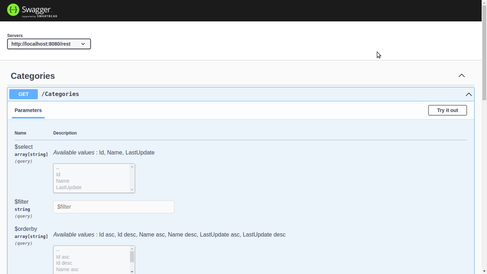

#### Welcome
Welcome to the Marim tutorial! Follow the steps below to develop your first data service in Marim.

#### Database
{: .mt-5}
This tutorial makes use of a sample database. To execute it, type the command

<pre><code class="language-bash">docker run --rm --network host marimplatform/dvdrental</code></pre>

#### Project
{: .mt-5}
A Marim project is simply a directory. Therefore, type the command below to create your project.

<pre><code class="language-bash">mkdir ./dvdrental</code></pre>

#### Specification
{: .mt-5}
Create the `./dvdrental/dvdrental.marim` file with the following service specification

<pre><code class="language-marim">table Category
    column Id         type integer
    column Name       type string
    column LastUpdate type timestamp

source DvdRental
    dialect  postgresql
    driver   "org.postgresql.Driver"
    url      "jdbc:postgresql://localhost:5432/dvdrental"
    property "user" "postgres"
    property "password" "postgres"

query Category
    parameter Id type integer not null

    result 
        table Category

    source DvdRental

    statement "
        select category_id as Id, 
               name        as Name,
               last_update as LastUpdate
          from category
         where category_id = (" Id ") 
    "</code></pre>

#### Execution
{: .mt-5}
Execute the service typing the command

<pre><code class="language-bash">docker run --rm -v $(pwd)/dvdrental:/marim -p 8080:8080 marimplatform/service</code></pre>

#### Request
{: .mt-5}
Type the command below to send a request to the service.

<pre><code class="language-bash">curl http://localhost:8080/rest/Category?Id=1</code></pre>

The service will respond

<pre><code class="language-json">[{"Id":1,"Name":"Action","LastUpdate":"2006-02-15T09:46:27Z"}]</code></pre>

#### OpenAPI
{: .mt-5}
Request the service OpenAPI specification typing the command

<pre><code class="language-bash">curl http://localhost:8080/openapi</code></pre>

The service will respond

<pre><code class="language-json">{
  "openapi" : "3.0.1",
  "servers" : [ {
    "url" : "http://localhost:8080/rest"
  } ],
  "paths" : {
    "/Category" : {
      "get" : {
        "tags" : [ "Category" ],
        "responses" : {
          "200" : {
            "description" : "OK",
            "content" : {
              "application/json" : {
                "schema" : {
                  "type" : "array",
                  "items" : {
                    "type" : "object",
                    "properties" : {
                      "Id" : {
                        "type" : "integer",
                        "format" : "int64"
                      },
                      "Name" : {
                        "type" : "string"
                      },
                      "LastUpdate" : {
                        "type" : "string",
                        "format" : "date-time"
                      }
                    }
                  }
                }
              },
              "text/csv" : { }
            }
          },
          "400" : {
            "description" : "BAD_REQUEST",
            "content" : {
              "text/plain" : {
                "schema" : {
                  "type" : "string"
                }
              }
            }
          },
          "500" : {
            "description" : "INTERNAL_SERVER_ERROR",
            "content" : {
              "text/plain" : {
                "schema" : {
                  "type" : "string"
                }
              }
            }
          }
        }
      },
      "post" : {
        "tags" : [ "Category" ],
        "responses" : {
          "200" : {
            "description" : "OK",
            "content" : {
              "application/json" : {
                "schema" : {
                  "type" : "array",
                  "items" : {
                    "type" : "object",
                    "properties" : {
                      "Id" : {
                        "type" : "integer",
                        "format" : "int64"
                      },
                      "Name" : {
                        "type" : "string"
                      },
                      "LastUpdate" : {
                        "type" : "string",
                        "format" : "date-time"
                      }
                    }
                  }
                }
              },
              "text/csv" : { }
            }
          },
          "400" : {
            "description" : "BAD_REQUEST",
            "content" : {
              "text/plain" : {
                "schema" : {
                  "type" : "string"
                }
              }
            }
          },
          "500" : {
            "description" : "INTERNAL_SERVER_ERROR",
            "content" : {
              "text/plain" : {
                "schema" : {
                  "type" : "string"
                }
              }
            }
          }
        }
      },
      "parameters" : [ {
        "name" : "Id",
        "in" : "query",
        "required" : true,
        "explode" : false,
        "schema" : {
          "type" : "integer",
          "format" : "int64"
        }
      }, {
        "name" : "$select",
        "in" : "query",
        "style" : "form",
        "explode" : false,
        "schema" : {
          "type" : "array",
          "items" : {
            "type" : "string",
            "enum" : [ "Id", "Name", "LastUpdate" ]
          }
        }
      }, {
        "name" : "$filter",
        "in" : "query",
        "schema" : {
          "type" : "string"
        }
      }, {
        "name" : "$orderby",
        "in" : "query",
        "style" : "form",
        "explode" : false,
        "schema" : {
          "type" : "array",
          "items" : {
            "type" : "string",
            "enum" : [ "Id asc", "Id desc", "Name asc", "Name desc", "LastUpdate asc", "LastUpdate desc" ]
          }
        }
      }, {
        "name" : "$skip",
        "in" : "query",
        "schema" : {
          "type" : "integer",
          "format" : "int64",
          "maximum" : 9223372036854775807,
          "minimum" : 0
        }
      }, {
        "name" : "$top",
        "in" : "query",
        "schema" : {
          "type" : "integer",
          "format" : "int32",
          "maximum" : 2147483647,
          "minimum" : 1
        }
      } ]
    }
  }
}</code></pre>

#### Swagger UI
{: .mt-5}
Open the address `http://localhost:8080/swagger-ui` in a browser to visualize the service OpenAPI specification and send requests to it in a more human-friendly way through the embedded [Swagger UI](https://swagger.io/tools/swagger-ui/) application

    

#### Next steps
{: .mt-5}
Read the [manual](/manual.html) to learn more about Marim.